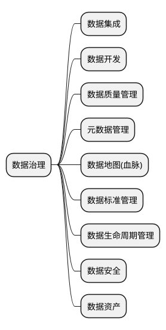

# 数据治理

## 治理目的

  数据治理的目标是提高数据的质量（准确性、及时性、完整性、唯一性、一致性，有效性），确保数据的安全性（保密性、完整性及可用性），实现数据资源在各组织机构部门的共享，推进数据资源的整合、服务和共享，从而提升企事业单位信息化水平，充分发挥数据资产作用。

## 治理环节

```puml
@startmindmap
* 数据治理
** 数据集成
** 数据开发
** 数据质量管理
** 元数据管理
** 数据地图(血脉)
** 数据标准管理
** 数据生命周期管理
** 数据安全
** 数据资产
@endmindmap
```

## 数据集成
多源数据集成

数据采集
 业务数据
 埋点数据

