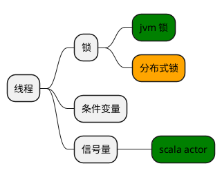
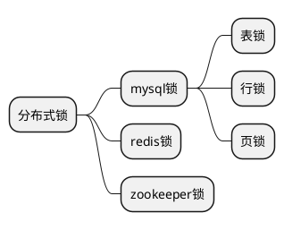

# 分布式锁
 <p align= right>2021/6/9 </p>

---
##  线程同步
指线程协同处理。方式锁、条件变量、信号量。
<h1 style="text-align:center">

</h1>
## 分布式锁

```puml
node node1
node node2
node node3
node node4
database sharebase
node1 -- sharebase
node2 -- sharebase
node3 -- sharebase
node4 -- sharebase
```


分类：
<h1 style="text-align:center">


