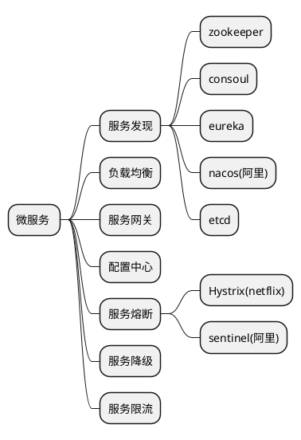

## 微服务
 是对服务治理的过程.
 
 有两个主流的服务治理的基础设施 SPRING_CLOUD 和lstio


## 服务治理

什么服务:
  社会学中:为他人的利益提供有偿和无偿的活动.
### 服务注册和发现

	tips:DNS接口,DNS是一个分布式数据库. 

 服务目录就是API目录,如果是Rest-ful风格就是资源的目录.
 目录需要注册然后被发现.

 注册就是对API资源的创建,
 对于API的管理,需要监控服务是否可用,一般使用心跳机制.


nacos:
  region

### 服务熔断
 当服务A调用服务B的时候,出现服务B不可调用的情况,直接返回一个结构.目的是减轻压力.直到服务B恢复.
 ```puml
 @startmindmap
 * 服务熔断
 ** close --达到失败阈值的时候启动熔断器
 ** open --直接返回,一段时候后进入半打开状态.
 ** half-open --部分返回访问,如果成功,则任务服务恢复.关闭熔断器.
 @endmindmap
 ```     

 ### 服务降级
 降级是根据业务需求,人为的降低系统负载

 服务雪崩 联级故障

 ### 服务限流

 在服务峰值的时候,也就是高并发的时候,场景在秒少的时候. 在请求数据上限制.防止被压跨.

 算法:

 窗口计算
 滑动窗口计算
 令牌桶
 漏桶

 